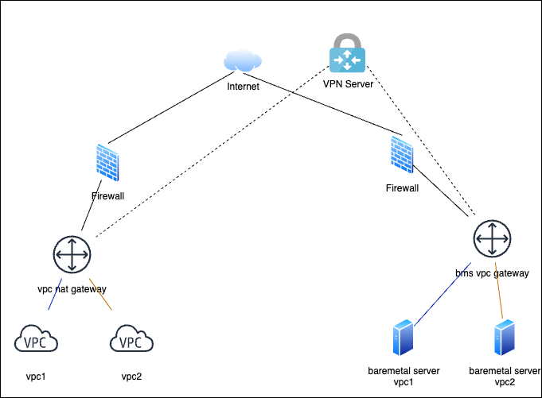
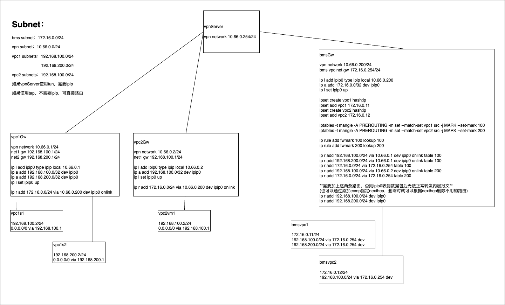

# 跨数据中心裸金属和vpc网络互联方案

## 摘要

如图所示云平台环境和裸金属属于不同数据中心，两数据中心都位于防火墙内，且网络不可直达。现需要将裸金属接入云平台进行统一纳管。云平台内划分VPC，一台裸金属服务器只能属于一个VPC。不同VPC网段可重叠。

现在需要将VPC网段和裸金属网络打通，且VPC内云主机或容器只允许访问属于该VPC内的裸金属服务器。

## 实现思路
* 在互联网上搭建VPN Server
* 裸金属数据中心起一台虚机作为裸金属访问VPC的网关（bms vpc gateway），每个裸金属设置访问VPC网段的路由下一跳指向bms vpc gateway。bms vpc gateway接入VPN网络。
* 每个VPC的VPC网关（vpc nat gateway）接入VPN网络。
* 根据VPN实现类型，如果是tap设备，及传输的以太网流量，VPN Server可根据路由nexthop的mac地址进行数据转发；如果是tun设备，及传输的是IP层流量，VPN Server需要根据dst ip将流量进行转发。但是由于VPC网段可以重合，所以存在不同的VPC流量有着相同的dst ip的情况。对于上述情况，需要通过IPIP设备将原始IP层流量外再封装一层IP头部，以此屏蔽内层流量的dst ip信息。
* bms vpc gateway通过ipset维护vpc内的裸金属服务器集合。通过iptables根据ipset中裸金属服务器ip识别流量所属VPC，并打上fwmark。再添加策略路由，根据fwmark将流量转发至IPIP口并设置对应VPC的remote ip。对于tap实现的VPN可直接指定nexthop为目标VPC的VPN网段IP。

以下为常见的VPN及实现方式：

tun实现的VPN：wireguard，[vtun](https://github.com/lucheng0127/vtun)

tap实现的VPN：[virtuallan](https://github.com/lucheng0127/virtuallan)

## 详细方案

方案涉及的IPIP配置，ipset集合，iptables规则及策略路由见上图。

## 附:
测试环境搭建脚本见script目录[setup_topo.sh](./script/setup_topo.sh)

### 如果vpc网络和裸金属网络路由可达
[裸金属VPC网络路由可达时网络方案](./docs/vpc和bms网络可达方案.png)