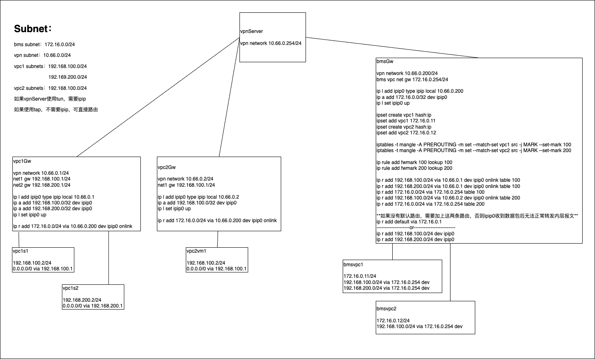

# 裸金属和vpc网络互联方案

## 环境说明
VPC和裸金属机房不可直连，通过VPN server先打通VPC gateway和裸金属机房网络。
由于不同VPC网段可重叠，所以需要识别裸金属和不同VPC的流量。
如果VPN使用tap设备实现，则可根据路由nexthop的mac地址进行流量转发。
如果VPN使用tun设备实现，VPN server需要根据dst ip进行流量转发，所以需要使用IPIP，
将原有流量外层封上VPN网段的IP。
tun实现的VPN：wireguard，[vtun](https://github.com/lucheng0127/vtun)
tap实现的VPN：[virtuallan](https://github.com/lucheng0127/virtuallan)

## 方案架构

* 通过ipset维护属于不同VPC的裸金属机器
* 通过iptables配合ipset将流量打fwmark
* 根据fwmark走不同的策略路由
* 通过IPIP隐藏内层数据报文，确保tun实现的vpn server能正确转发数据报文

###
测试环境脚本见script目录